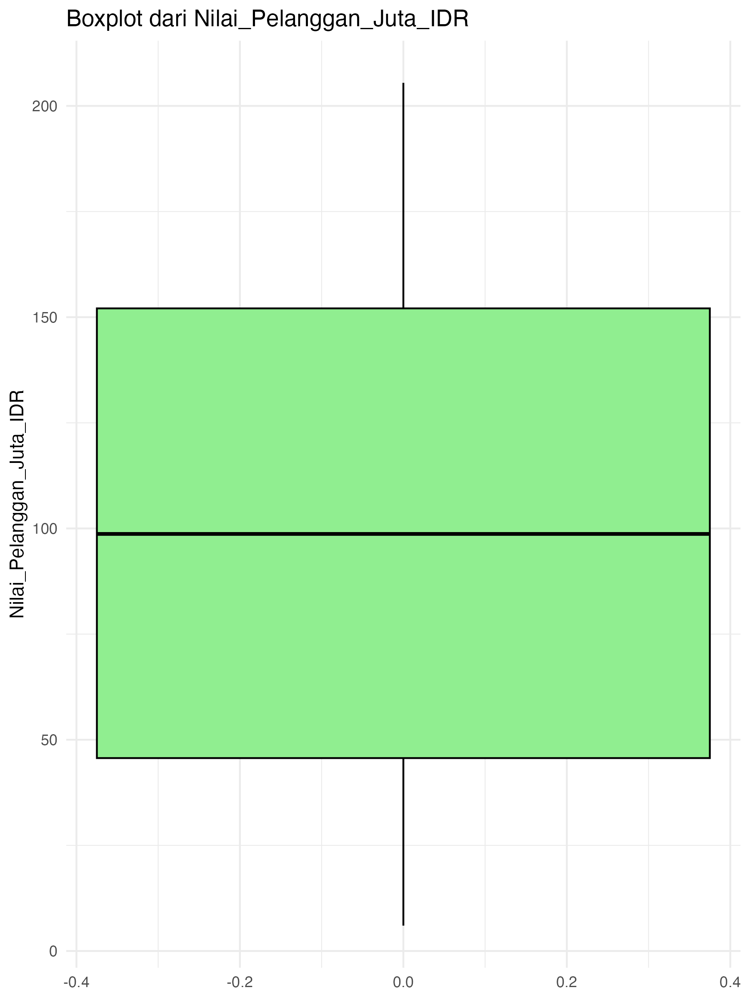
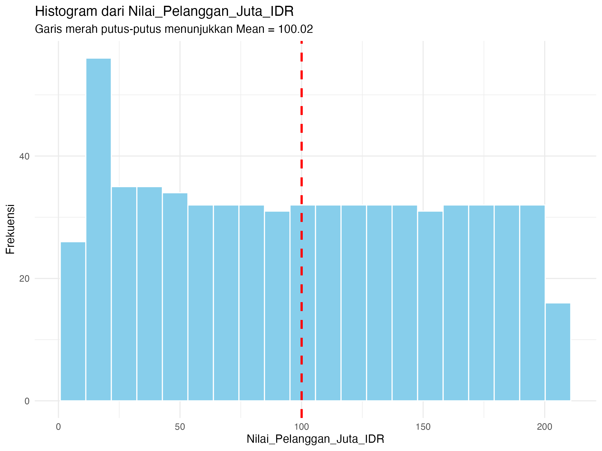
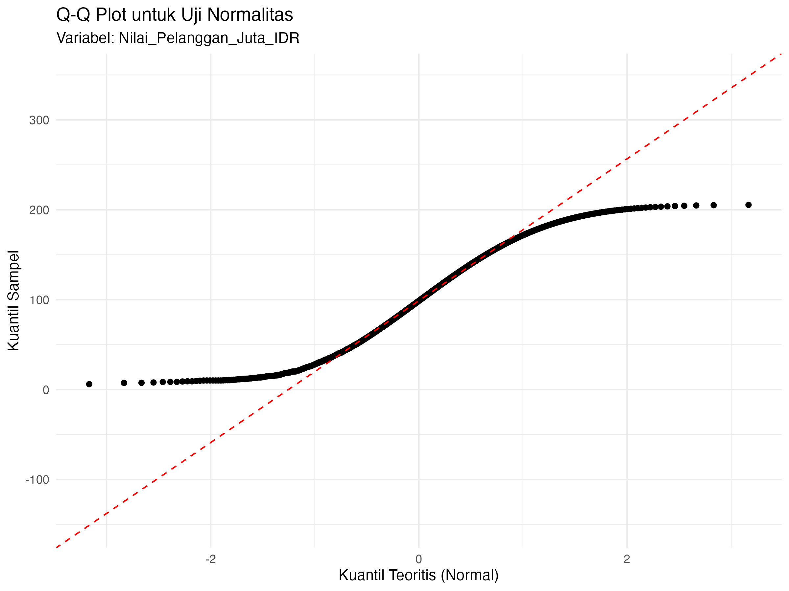
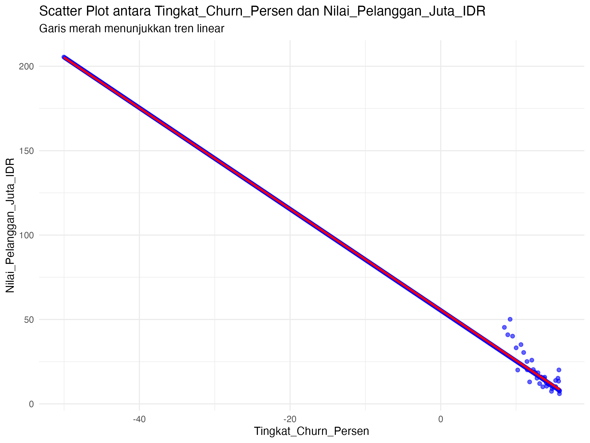
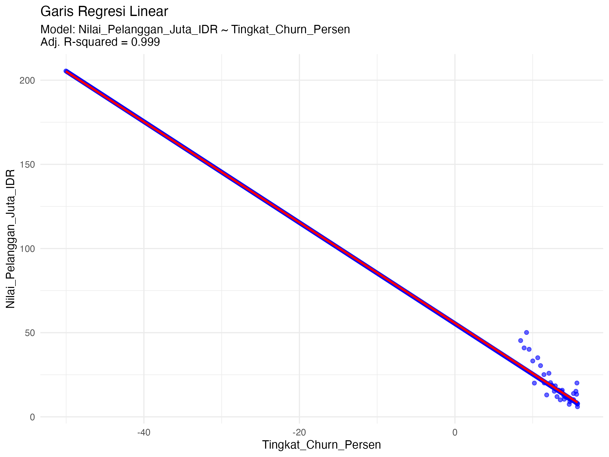

---
editor_options:
  markdown:
    wrap: sentence
---

# Tugas Analisis Statistik: Deskriptif, Korelasi, dan Regresi

## 1. Informasi Penyusun

- **Nama:** Rahmat Kautsar
- **NIM:** 2515101027
- **Program Studi:** Ilmu Komputer
- **Mata Kuliah:** Statistika dan Probabilitas

------------------------------------------------------------------------

## 2. Deskripsi Proyek

Proyek ini menggunakan dataset `data_startup_saas.csv` yang berisi data numerik terkait kinerja startup berbasis Software as a Service (SaaS), khususnya variabel **Nilai_Pelanggan_Juta_IDR** dan **Tingkat_Churn_Persen**.
Dataset ini digunakan untuk menggambarkan kondisi bisnis serta hubungan antar indikator utama startup.

Tujuan dari analisis ini adalah untuk mendeskripsikan karakteristik data, menguji asumsi statistik, serta menganalisis hubungan antar variabel, khususnya hubungan antara nilai pelanggan dan tingkat churn, menggunakan analisis deskriptif, korelasi, dan regresi linear sederhana.

------------------------------------------------------------------------

## 3. Struktur Proyek

Proyek ini diorganisir ke dalam beberapa folder berikut:

- `/data`  
  Berisi dataset mentah yang digunakan untuk analisis.
- `/scripts`  
  Berisi seluruh skrip R yang digunakan dalam analisis, disusun sesuai alur kerja.
- `/results`  
  Berisi output hasil analisis berupa plot, grafik, dan tabel ringkasan.

------------------------------------------------------------------------

## 4. Cara Menjalankan Analisis

Untuk mereproduksi hasil analisis, ikuti langkah-langkah berikut:

1. Pastikan R dan RStudio telah terinstal pada komputer Anda.
2. Buka proyek ini menggunakan RStudio.
3. Instal paket yang diperlukan dengan menjalankan perintah berikut di konsol R:

```r
install.packages(c("tidyverse", "corrplot", "knitr"))
```

4. Jalankan skrip pada folder `/scripts` secara berurutan, mulai dari `01_data_preparation.R` hingga `05_analisis_regresi.R`.

------------------------------------------------------------------------

## 5. Hasil dan Interpretasi

Bagian ini menyajikan serta menginterpretasikan hasil dari setiap tahap analisis statistik.

### 5.1 Statistik Deskriptif

Analisis statistik deskriptif dilakukan pada variabel **Nilai_Pelanggan_Juta_IDR**.

- **Ukuran Pemusatan (Mean, Median, Modus):**  
  Hasil perhitungan menunjukkan adanya perbedaan antara nilai mean dan median, yang mengindikasikan bahwa distribusi data tidak sepenuhnya simetris. Nilai modus menunjukkan nilai yang paling sering muncul dan merepresentasikan kecenderungan umum nilai pelanggan.

- **Ukuran Sebaran (Standar Deviasi, Range, Kuartil):**  
  Nilai standar deviasi dan range menunjukkan bahwa data nilai pelanggan memiliki tingkat variasi yang cukup besar.

- **Visualisasi (Histogram dan Boxplot):**  




Distribusi data menunjukkan bahwa nilai pelanggan tidak sepenuhnya normal.

### 5.2 Uji Normalitas

Uji normalitas dilakukan terhadap variabel **Nilai_Pelanggan_Juta_IDR**.

- **Hasil Uji Shapiro-Wilk:**  
  Nilai p-value ≤ 0,05 menunjukkan bahwa data tidak berdistribusi normal.

- **Plot Q-Q:**  



### 5.3 Analisis Korelasi

Analisis korelasi dilakukan antara **Tingkat_Churn_Persen** dan **Nilai_Pelanggan_Juta_IDR**.

- **Scatter Plot:**  



Hubungan antar variabel menunjukkan pola linear yang cukup jelas.

### 5.4 Analisis Regresi Linear

Analisis regresi linear sederhana digunakan untuk memodelkan pengaruh **Tingkat_Churn_Persen** terhadap **Nilai_Pelanggan_Juta_IDR**.

- **Model Regresi:**  

```
Nilai_Pelanggan_Juta_IDR = b0 + b1 × Tingkat_Churn_Persen
```

- **Visualisasi Garis Regresi:**  



------------------------------------------------------------------------

## 6. Kesimpulan

Berdasarkan hasil analisis, dapat disimpulkan bahwa **Tingkat_Churn_Persen** memiliki hubungan dan pengaruh terhadap **Nilai_Pelanggan_Juta_IDR**. Hasil analisis korelasi menunjukkan adanya hubungan linear antara kedua variabel tersebut, yang kemudian diperkuat melalui analisis regresi linear sederhana.

Model regresi yang dibangun menunjukkan bahwa perubahan tingkat churn dapat menjelaskan sebagian variasi nilai pelanggan. Dengan demikian, tingkat churn dapat digunakan sebagai indikator penting dalam memahami dan memprediksi nilai pelanggan pada startup berbasis Software as a Service (SaaS).

